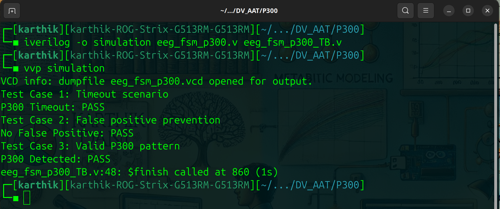
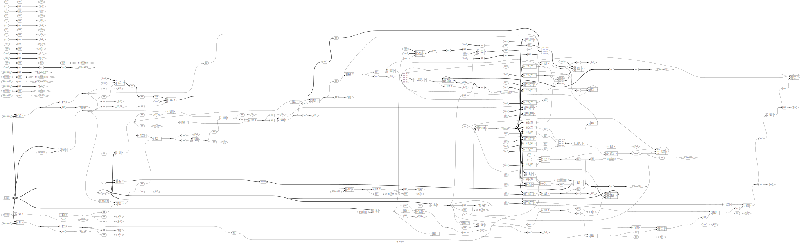

### Detailed Description of `eeg_fsm_p300` Module

The `eeg_fsm_p300` module is a Finite State Machine (FSM) designed to detect a P300 pattern from an input EEG signal. This is achieved by processing the signal through various states based on predefined thresholds and timing constraints.

#### Inputs and Outputs:
1. **Inputs:**
   - `clk` (Clock Signal): The clock signal synchronizes state transitions.
   - `reset` (Reset Signal): When asserted, resets the FSM to its initial state (`IDLE`).
   - `eeg_signal` (8-bit EEG Signal): Represents the EEG input signal, where values are processed to detect the P300 pattern.

2. **Outputs:**
   - `detected` (P300 Detected): Indicates whether the P300 pattern is detected. Outputs `1` when detected and `0` otherwise.

#### Parameters:
The FSM consists of five distinct states, each represented by a 3-bit encoding:
- `IDLE`: Initial state, where the system waits for the EEG signal to rise above a baseline.
- `RISING`: Indicates that the signal is rising and approaching the P300 threshold.
- `PEAK`: Denotes that the signal has reached the peak amplitude, which exceeds a predefined threshold.
- `FALLING`: Represents the decay phase of the signal as it returns toward the baseline.
- `DETECTED`: Confirms the detection of a valid P300 pattern.

#### Thresholds:
- `baseline` (50): The calibrated baseline value of the EEG signal.
- `rise_threshold` (70): Minimum signal amplitude required for a valid peak.
- `fall_threshold` (60): Minimum signal value after the peak indicating decay.

#### Counter:
A 10-bit counter is used to track time during the `RISING` and `PEAK` states. This ensures the P300 pattern detection occurs within a 300ms window. The counter is reset when the FSM leaves these states.

---

### FSM Functionality:
The FSM operates sequentially, with transitions governed by the EEG signal characteristics and timing constraints. Here's a breakdown of its behavior in each state:

1. **IDLE State:**
   - The FSM waits for the `eeg_signal` to exceed the `baseline` value.
   - If this condition is met, the FSM transitions to the `RISING` state.
   - Otherwise, the FSM remains in `IDLE`.

2. **RISING State:**
   - In this state, the FSM monitors whether the signal continues to rise:
     - If the signal exceeds `rise_threshold`, it transitions to the `PEAK` state.
     - If the signal returns to or falls below the `baseline`, it transitions back to `IDLE` (false start).
     - If the counter exceeds 300ms, the FSM resets to `IDLE` (timeout condition).

3. **PEAK State:**
   - Here, the FSM checks if the signal starts to decay:
     - If the signal falls below `fall_threshold`, it transitions to the `FALLING` state.
     - If the signal falls below `rise_threshold`, it resets to `IDLE` (false pattern).
     - If the counter exceeds 300ms, it resets to `IDLE` (timeout condition).

4. **FALLING State:**
   - The FSM monitors whether the signal has returned to the `baseline` value.
   - If this condition is met, it transitions to the `DETECTED` state.

5. **DETECTED State:**
   - The FSM sets the `detected` signal to `1`, indicating that the P300 pattern has been detected.
   - The FSM then resets to the `IDLE` state for further detection.

6. **Default Case:**
   - Handles any unexpected state transitions by resetting the FSM to the `IDLE` state and clearing the `detected` output.

---

### Design Features:
1. **Timing Constraints:**
   - The use of a counter ensures that the P300 detection occurs within a biologically plausible window (300ms).
   - Any signal behavior exceeding this duration is treated as invalid.

2. **Robustness:**
   - The FSM includes a default case to handle unexpected state transitions, ensuring reliable operation.
   - Reset functionality ensures the system starts from a clean state when required.

3. **Threshold-Based Decision Making:**
   - The FSM uses calibrated thresholds (`baseline`, `rise_threshold`, and `fall_threshold`) to evaluate the P300 pattern, making it adaptable to real-world EEG data.

4. **Efficiency:**
   - The design uses minimal resources (3-bit state encoding and a 10-bit counter) for efficient hardware implementation.

---

### Key Observations:
**OS Used:** Linux Ubuntu 24.04

All the 3 Test Cases PASSED.
- **Detection Logic:** The `detected` signal is asserted only in the `DETECTED` state. It is reset in subsequent cycles to prepare for new detections.
- **State Reset:** The FSM resets to the `IDLE` state after each detection or invalid signal sequence.

This module is a critical component for real-time EEG analysis systems, providing accurate and efficient detection of the P300 event-related potential, commonly used in brain-computer interfaces and cognitive neuroscience.

## Gate Level Hardware Implementation

- **Yosys Open SYnthesis Suite (Yosys)** is an open-source digital synthesis tool that is widely used in the hardware design and verification domain. It serves as a synthesis engine for hardware description languages (HDLs) such as Verilog and SystemVerilog. 

- **Feature Used:** Yosys takes high-level designs written in these languages and translates them into optimized netlist representations (gate-level descriptions), which can then be used for further design, simulation, and implementation (e.g., for FPGA or ASIC designs).

- **Synthesis:**
