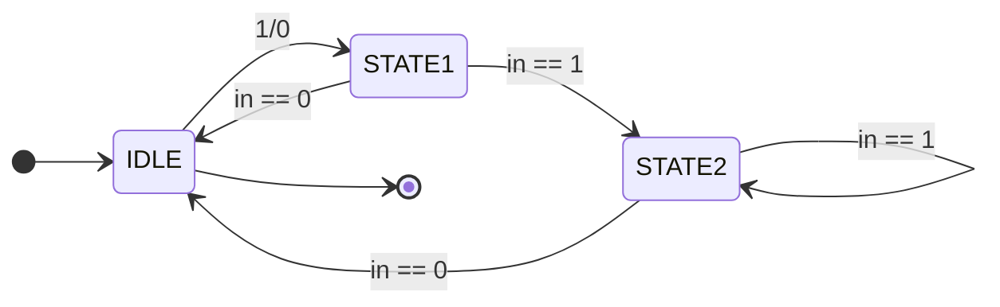

```mermaid
stateDiagram-v2
direction LR
    [*] --> IDLE
    IDLE --> STATE1 : 1/0
    STATE1 --> STATE2 : in == 1
    STATE1 --> IDLE : in == 0
    STATE2 --> STATE2 : in == 1
    STATE2 --> IDLE : in == 0
    IDLE --> [*]
```